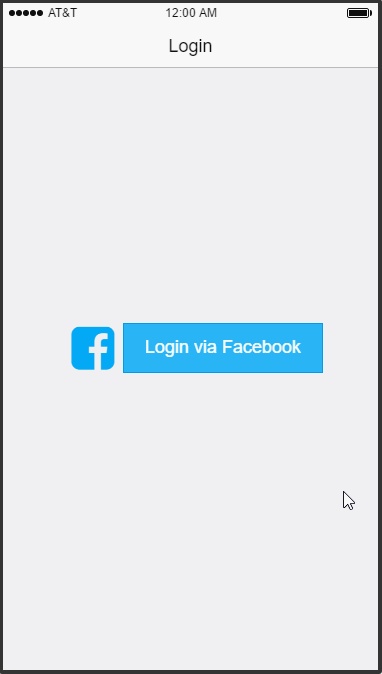

##ShareGroupLocation
An iOS Swift application for group comunication. User can use this app to share location, chat group, find a place which is nearest all of group members.

### Features

#### Required
- [ ] User can login/logout/signup
- [ ] User can access phone contact
- [ ] User can create hangout group by using system contact
    - [ ] Edit group information
    - [ ] Add/remove member
    - [ ] Leave group
- [ ] User can share location to group
    - [ ] Select a group to share current location to all member of the group
    - [ ] View the map to see location of members who joined in
    - [ ] Auto synchronize the map when the other members join in or leave out
    - [ ] Can automatically scale the map size which we can see all online members on the map view
    - [ ] Back to list of group will be stop sharing location
    - [ ] Back to home screen or turn off device will not stop sharing
- [ ] Set destination to hangout
    - [ ] Load coffee shop, restaurant, hotel, ATM and places in current map view
    - [ ] Select places or point and hold 2 seconds on map view to set destination and view direction from all member locations
    - [ ] Direction should show the estimate time how long to get there
    
#### Optional
- [ ] Login Facebook/Twitter
- [ ] Can sync Facebook friends (or Google contacts) to system contact
- [ ] Group chat
    - [ ] Can send plain text message to group
    - [ ] Can set time for each hangout for on-time report
    - [ ] Can easy to switch to the app from imessage
    
    

Our small survey:
https://docs.google.com/forms/d/1SmK7uBspaH23wReSyJGkhL7-9xrcW4uppJv87b3A4gA/viewanalytics

### Wireframe Walkthrough

Libraries we are using:
- FireBase
- AFNetworking
- MBProgressHUD
